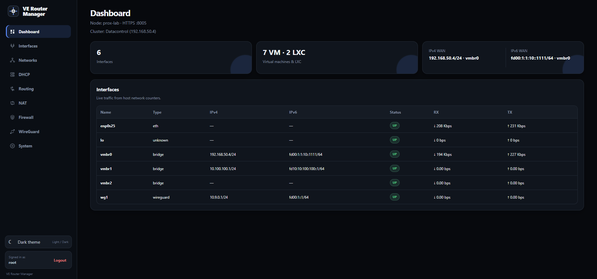

<h1> VE Router Manager</h1>

**VE Router Manager (PRM)** is a lightweight network and router management interface for **Proxmox VE**.

PRM runs directly on the Proxmox host and provides a dedicated web interface for routing, NAT, DHCP, IPv4/IPv6, WireGuard and Proxmox firewall integration — without requiring a separate router VM.

[Quick Start](#-quick-start) · [Features](#-what-can-prm-do) ·
[Screenshots](#-screenshots) · [Security](#-security-considerations) ·
[Roadmap](#-roadmap)



> Dashboard example — interface status, WAN addresses, virtual machine information and Proxmox cluster status in one place.

---

## Overview

PRM turns a Proxmox VE node into a manageable software router while keeping the native Proxmox VE interface available.

```text
Proxmox VE
├── Proxmox Web UI :8006
└── PRM Web UI     :8005
```

PRM focuses on the network layer:

- Interfaces
- Routing
- DHCP
- NAT44 / NAT66
- WireGuard
- IPv4 / IPv6
- Datacenter Firewall
- Node Firewall

Virtual machine and LXC lifecycle management remains in the native Proxmox VE interface.

---

## 🚀 What can PRM do

### Dashboard

The Dashboard provides an overview of the current Proxmox node:

- Node name
- PRM HTTPS port
- VM and LXC information
- Network interfaces
- WAN IPv4
- WAN IPv6
- Interface status
- RX / TX information
- Proxmox cluster information when available

Standalone node example:

```text
Node: prox-lab · HTTPS :8005
```

Cluster node example:

```text
Node: prox-lab · HTTPS :8005
Cluster: Main-cluster (192.168.0.10)
```

The cluster address shown is the Corosync address of the current node.

---

## Interfaces

PRM can manage Proxmox networking directly on the host.

Supported interface types include:

- Linux Bridge
- Bond
- VLAN
- Physical interfaces
- Virtual interfaces

Available operations:

- Create
- Edit
- Delete
- Bring interface Up
- Bring interface Down
- IPv4 configuration
- IPv6 configuration
- Interface status
- RX / TX statistics

PRM uses the native Proxmox network configuration and is designed to coexist with the Proxmox VE web interface.

---

## IPv4 and IPv6

PRM supports dual-stack networking.

### IPv4

Supported configuration includes:

- Static IPv4
- Gateway
- Routing
- NAT44
- DNAT
- SNAT
- DMZ
- DHCPv4

### IPv6

Supported configuration includes:

- Static IPv6
- SLAAC / Router Advertisement
- DHCPv6
- IPv6 routing
- NAT66
- WireGuard IPv6
- IPv6 forwarding

When **Static IPv6** is selected for an interface, PRM disables SLAAC/autoconfiguration on that interface so an additional dynamic IPv6 address is not created beside the configured static address.

Example:

```text
Static IPv6:
fd00:1:1:10::1111/64
```

---

## Routing

PRM provides IPv4 and IPv6 routing management directly on the Proxmox host.

Supported operations include:

- View existing routes
- Add static routes
- Edit PRM-managed routes
- Delete PRM-managed routes
- IPv4 default routes
- IPv6 default routes
- IPv4 forwarding
- IPv6 forwarding

Example:

```text
10.100.100.0/24      dev vmbr1
fd10:10:100:100::/64 dev vmbr1
fd00:1::/64          dev wg1
```

---

## DHCP

PRM includes integrated DHCP services for Proxmox networks.

### DHCPv4

Features include:

- IPv4 pools
- Default gateway
- DNS servers
- Lease time
- Static reservations
- Lease monitoring

### DHCPv6

Features include:

- DHCPv6 pools
- IPv6 DNS servers
- Static reservations
- DHCPv6 leases

### SLAAC

Router Advertisement can be enabled for IPv6 networks.

DHCPv6 and SLAAC can also be used together.

Example network:

```text
PRM vmbr1:
10.100.100.1/24
fd10:10:100:100::1/64
```

Example client:

```text
10.100.100.2
fd10:10:100:100::2
```

PRM automatically creates the required Node Firewall rules for active DHCP services.

---

## NAT

PRM supports both IPv4 and IPv6 NAT.

### NAT44

Supported types:

- SNAT
- MASQUERADE
- DNAT
- DMZ

### NAT66

Supported IPv6 NAT functionality includes:

- IPv6 source NAT
- IPv6 masquerade
- IPv6 destination NAT

---

## DNAT and DMZ priority

Explicit DNAT rules have priority over DMZ.

Processing order:

```text
1. Specific DNAT rules
2. DMZ exclusions
3. DMZ
```

Example:

```text
TCP 443  → 10.100.100.20:443
TCP 8080 → 10.100.100.30:80
DMZ      → 10.100.100.100
```

Result:

```text
TCP 443        → 10.100.100.20
TCP 8080       → 10.100.100.30
Other traffic  → 10.100.100.100
```

DMZ therefore acts as the final fallback.

PRM automatically excludes its required management and service ports from DMZ when necessary.

---

## SNAT priority

When SNAT rules overlap, more specific networks are processed first.

Example:

```text
10.100.100.50/32 → specific SNAT
10.100.100.0/24  → MASQUERADE
```

The `/32` rule is evaluated before the `/24` rule.

The same principle applies to IPv6:

```text
/128 before /64
```

---

## WireGuard

PRM includes integrated WireGuard management.

Features include:

- Multiple WireGuard interfaces
- IPv4 addresses
- IPv6 addresses
- Peer management
- Client configuration generation
- Per-peer network access
- Internet access
- IPv4 NAT
- IPv6 NAT66
- Persistent keepalive
- Live peer status

Live information includes:

- ACTIVE / INACTIVE status
- Latest handshake
- Remote endpoint
- RX
- TX

Example:

```text
wg1:
10.9.0.1/24
fd00:1::1/64

Peer:
10.9.0.2/32
fd00:1::2/128
```

WireGuard peers can access internal networks through normal routing.

Example:

```text
WireGuard:
fd00:1::2

Internal network:
fd10:10:100:100::/64

Pi-hole:
fd10:10:100:100::2
```

No NAT66 is required between these networks when normal IPv6 routing is used.

---

## Firewall

PRM deliberately manages only two Proxmox firewall scopes:

```text
Datacenter Firewall
Node Firewall
```

VM and LXC firewall configuration is intentionally left to the native Proxmox VE interface.

This keeps PRM focused on networking and avoids duplicating guest-level management already provided by Proxmox.

### Datacenter Firewall

Datacenter Firewall configuration is cluster-wide.

Typical uses:

- Common management access rules
- Cluster-wide security policy
- INPUT rules
- OUTPUT rules
- FORWARD rules
- Default policies

Example:

```text
IN ACCEPT
Source: 192.168.0.0/24
Protocol: TCP
Destination Port: 8006
```

### Node Firewall

Node Firewall rules apply to the Proxmox node where PRM is running.

PRM automatically maintains required Node Firewall rules for services such as:

- PRM HTTPS :8005
- DHCPv4
- DHCPv6
- WireGuard UDP listeners
- Required IPv6 traffic

PRM-generated automatic rules are protected from accidental modification or deletion.

---

## Firewall default policies

PRM exposes the Proxmox default firewall policies:

```text
INPUT
OUTPUT
FORWARD
```

Typical router-oriented configuration:

```text
INPUT:   DROP
OUTPUT:  ACCEPT
FORWARD: ACCEPT
```

Actual policies should be selected according to the required security model.

---

## Proxmox clusters

PRM can run on a Proxmox node that belongs to a cluster.

PRM continues to manage networking locally on the node where it is installed:

```text
Interfaces
Routing
NAT
DHCP
WireGuard
Node Firewall
```

Datacenter Firewall configuration remains cluster-wide through the native Proxmox cluster filesystem.

This means that if Datacenter Firewall configuration is changed from another Proxmox node, PRM will display the updated cluster configuration.

PRM does not attempt to manage networking on other cluster nodes remotely.

---

## Architecture

Example topology:

```text
                    Internet
                       │
                       │
                    vmbr0
                       │
              ┌────────┴────────┐
              │   Proxmox VE    │
              │       +         │
              │      PRM        │
              └────────┬────────┘
                       │
             ┌─────────┼─────────┐
             │         │         │
           vmbr1      wg1      other
             │         │
      10.100.100.0/24  │
 fd10:10:100:100::/64  │
             │         │
          VM/LXC    VPN peers
```

PRM runs directly on the Proxmox host.

No additional router VM is required.

---

## ⚡ Quick Start

Download the latest `.deb` package from GitHub Releases.

Install PRM:

```bash
apt install ./prm_0.4.24_all.deb
```

Open PRM:

```text
https://PROXMOX-IP:8005
```

The native Proxmox VE interface remains available at:

```text
https://PROXMOX-IP:8006
```

Upgrade an existing installation:

```bash
apt install ./prm_0.4.24_all.deb
```

Check installed version:

```bash
dpkg-query -W prm
```

---

## Access

PRM:

```text
https://PROXMOX-IP:8005
```

Native Proxmox VE:

```text
https://PROXMOX-IP:8006
```

Both interfaces can operate simultaneously.

---

## Authentication

PRM uses Proxmox host authentication.

Access is based on Linux PAM credentials from the Proxmox node.

PRM does not require a separate user database.

---

## Services

Depending on enabled features, PRM manages services and configuration related to:

```text
Networking
DHCP
NAT
WireGuard
Firewall
Routing
```

PRM networking changes are designed to remain persistent after reboot.

---

## 🔐 Security Considerations

PRM runs directly on the Proxmox host and can modify host-level networking, routing, NAT, DHCP, WireGuard and firewall configuration.

Recommended practices:

- Restrict access to PRM TCP port `8005` to trusted management networks.
- Keep the Proxmox host and PRM package updated.
- Use strong PAM credentials.
- Do not expose the PRM web interface directly to the public Internet unless it is protected by an appropriate firewall or VPN.
- Review Datacenter and Node Firewall rules carefully before applying restrictive policies.
- Keep access to the native Proxmox VE interface on port `8006` while testing network or firewall changes.
- Back up `/etc/network/interfaces` and relevant `/etc/pve/` firewall configuration before major changes.
- Never publish WireGuard private keys, passwords, tokens or other sensitive configuration in screenshots or issue reports.

Because PRM operates at the host networking layer, an incorrect route, NAT or firewall rule can cause loss of remote access to the Proxmox node.

---

## Upgrade safety

PRM is designed to preserve existing configuration during package upgrades.

Before major network changes, it is still recommended to keep a backup of:

```text
/etc/network/interfaces
/etc/pve/firewall/
/etc/pve/nodes/
```

Network changes should always be tested carefully on remote Proxmox systems to avoid losing management connectivity.

---

## Package

Current release:

```text
PRM v0.4.24
```

Package:

```text
prm_0.4.25_all.deb
```

SHA256:

```text
062809b1a3a9668623e39c695f5075b6f8f627cda4112369780d95b043d15faf
```

---

## Project scope

PRM is not intended to replace the Proxmox VE management interface.

Its purpose is to provide dedicated network and router management for the Proxmox host.

### Managed by PRM

```text
Interfaces
IPv4 / IPv6
Routing
DHCPv4 / DHCPv6
SLAAC
NAT44 / NAT66
SNAT / DNAT / DMZ
WireGuard
Datacenter Firewall
Node Firewall
```

### Managed by Proxmox VE

```text
Virtual machines
LXC containers
Guest firewall
Storage
Backups
Replication
HA
Cluster administration
```

---

## 📸 Screenshots

### Dashboard


Additional screenshots can be added as the project evolves.

---

## 🛣 Roadmap

Potential future improvements:

- Additional routing features
- VRF support
- Extended VLAN management
- Improved IPv6 diagnostics
- Network configuration backup / restore
- Firewall counters and logging
- Extended dashboard monitoring
- Additional VPN capabilities
- Improved cluster awareness
- Network topology visualization

---

## Contributing

Bug reports, feature requests and pull requests are welcome.

When reporting networking issues, please include relevant diagnostic information such as:

```text
PRM version
Proxmox VE version
Interface configuration
Routing table
Relevant nftables / firewall rules
```

Remove passwords, private keys, public addresses and other sensitive information before publishing logs.

---

## Disclaimer

PRM modifies host-level networking, routing, NAT and firewall configuration.

Incorrect network or firewall configuration can cause loss of access to the Proxmox node.

Always verify network changes carefully, especially on remotely managed servers.

---

<div align="center">

**VE Router Manager**

*Routing · NAT · DHCP · IPv4/IPv6 · WireGuard · Firewall for Proxmox VE*

**v0.4.25**

</div>
